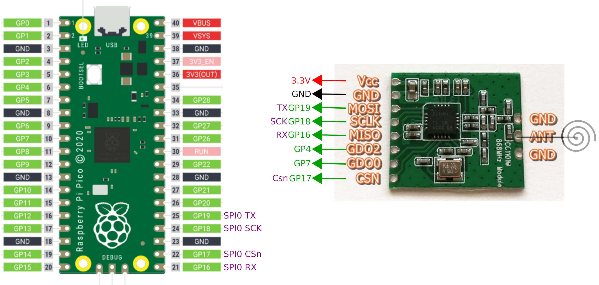
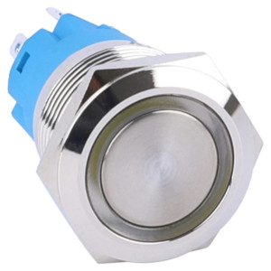

# Balise C++ et CC1101

## Matériel nécessaire

- carte Raspberry Pico
- module radio CC1101
- amplificateur audio MAX98357A
- haut-parleur 4ohms, 5W
- boîtier étanche (bloc de dérivation 15cmx15cm par exemple)

- Bouton lumineux 5V

!!! info 
    Le bouton lumineux est facultatif, mais permet l'accès au message de la balise aux personnes qui n'ont pas la télécommande.

## Assemblage

{: style="height:300px"}
{: style="height:150px"}
{: style="height:100px"}

## Programme

Les sources sont ici : 
[github.com/balises-ouistici/esp-arduino-nfs32002](https://github.com/balises-ouistici/esp-arduino-nfs32002)

## TO-DO

- vérifier le fonctionnement de la bibliothèque
- lire un son ; voir la bibliothèque [ESP8266Audio](https://github.com/earlephilhower/ESP8266Audio/) ?
