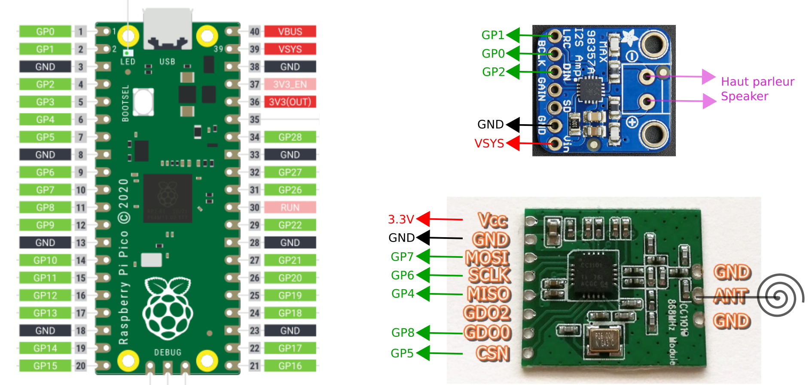

# Balise Pico-CC1101 CircuitPython 

Balise simple ou avec bouton lumineux

## Matériel nécessaire

- module CC1101
- Raspberry Pico
- Haut-Parleur 4ohms, 5W
- Module Amplificateur MAX98357A
- Boîtier étanche (bloc de dérivation 15cmx15cm par exemple)

- Bouton lumineux 5V

!!! info 
    Le bouton lumineux est facultatif, mais permet l'accès au message de la balise aux personnes qui n'ont pas la télécommande.

## Assemblage

{: style="height:300px"}
{: style="height:150px"}
{: style="height:100px"}

## Programme

Les sources sont ici : 
[github.com/balises-ouistici/circuitpython-nfs32002](https://github.com/balises-ouistici/circuitpython-nfs32002)

1. Télécharger les scripts CircuitPython
2. Préparer le Pico pour le programmer en CircuitPython (voir [la recette ici](../recettes/circuitpython.md))
3. Charger le programme dans le Pico

## TO-DO

voir [les questions et la feuille de route](questions.md)