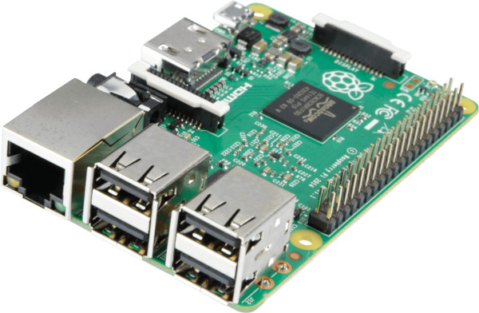
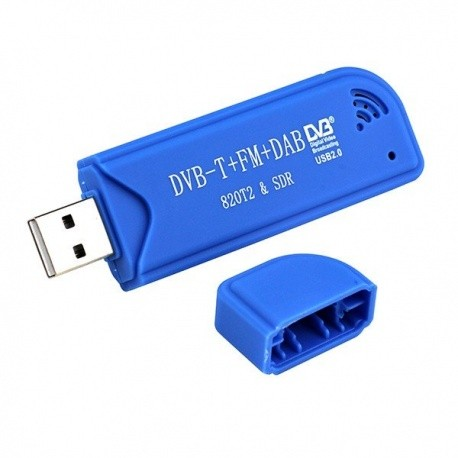

# Balise RTL-SDR

## Matériel nécessaire

- clé RTL-SDR
- antenne
- boîtier
- Raspberry Pi (v.)
- amplificateur audio et haut-parleur (voir la section Audio)

## Assemblage

{: style="height:150px"}
{: style="height:150px"}
{: style="height:150px"}

## Audio

Selon la version de Raspberry Pi utilisée, il y a différentes possiblités pour la sortie son.

- `Raspberry Pi Zero, 3B, 4B` : module IQaudio Zero : [voir la recette IQaudio Zero](../recettes/iqaudio_zero.md)
- `Raspberry Pi 2 / 3 / 4` : amplificateur audio et haut-parleur intégré (enceinte de bureau, enceinte blutooth)

## Programme

Les sources sont ici : 
[github.com/balises-ouistici/rtlsdr-nfs32002](https://github.com/balises-ouistici/rtlsdr-nfs32002)

1. Télécharger les scripts Python sur votre Raspberry
2. Vérifier que vous avez toutes les bibliothèques nécessaires
3. Activer le script au démarrage du Raspberry [(voir la recette)](../recettes/script_demarrage.md)
4. Vous pouvez désactiver l'affichage "Desktop"
