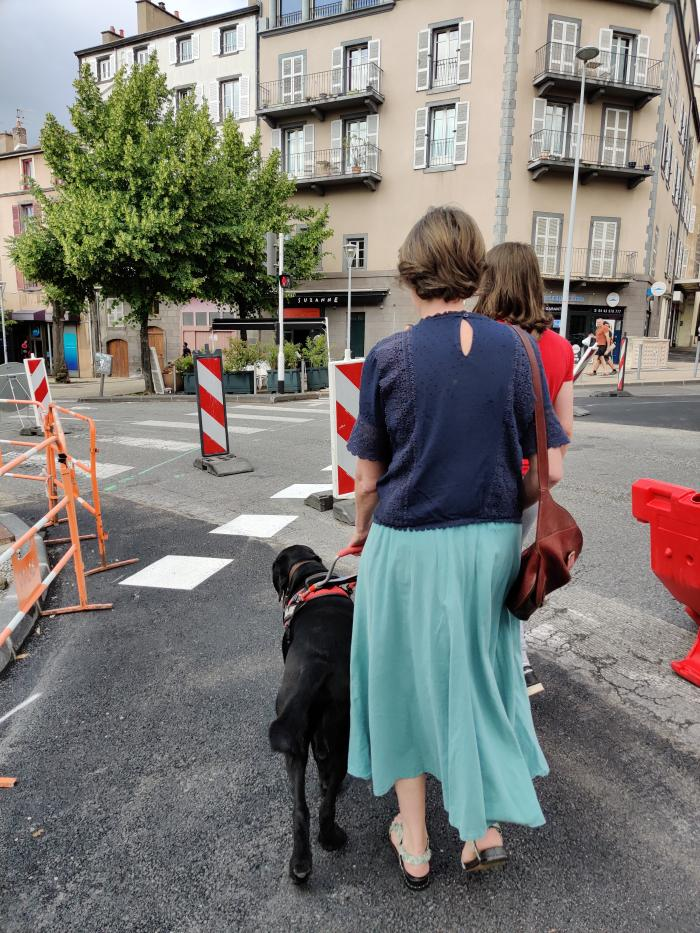

# 1- Chantiers et balisage temporaire

##  Contexte

Nous sommes allés voir (avec Laurence comme guide experte) le carrefour en travaux en haut du boulevard Lafayette. Nous avons constaté une difficulté pour accéder au jardin Lecoq à partir du Musée Bargoin, sur la traversée du boulevard Lafayette.

- Nous avons pris des photos qui seront reportées en commentaires sur une carte pour expliquer les problèmes
- Nous avons enregistré des messages qui pourraient être délivrés par des balises de travaux (provisoires) afin de guider les personnes le temps de la réalisation des travaux.

L'après midi, nous prévoyons de retourner avec de nouveaux experts pour tester  nos essais, les améliorer peut-être.

## Informations disponibles 

Les informations à propos des travaux sur la métropole de Clermont-Ferrand sont centralisées sur le site [C le Chantier](https://www.clermontmetropole.eu/c-le-chantier-travaux/).

On y trouve des schémas qui montrent les tronçons en travaux, les modalités de circulation pour les véhicules motorisés.

## Objectifs idéaux :

1. Être en mesure d'intervenir rapidement, à la demande, sur des désordres liés aux chantiers, notamment ceux du programme Inspire qui devrait durer trois ans.
2. Avec des balises peu coûteuses et une participation citoyenne (on pense au comptage des oiseaux réalisé par la LPO, au nettoyage des plages, ce genre d'initiative citoyenne).

Une carte facilmap est en construction ici : <https://facilmap.org/hackaton%231ouistici>

Fonds de carte : <http://osm.cquest.org/dev/#14/48.8500/2.3500> 

## Quelques photos du carrefour en travaux

<a href="../chantier-1.jpg">
<figure markdown style="float:left;margin:10px;width:300px">
  
  <figcaption>Vue des barrières depuis le musée Bargoin</figcaption>
</figure>
</a>
<a href="../chantier-2.jpg">
<figure markdown style="float:left;margin:10px;width:300px">
  
  <figcaption>Traversée du premier passage piéton et insertion dans le couloir aménagé</figcaption>
</figure>
</a>
<a href="../chantier-3.jpg">
<figure markdown style="float:left;margin:10px;width:300px">
  
  <figcaption>Vue depuis le couloir aménagé (chemin de contournement)</figcaption>
</figure>
</a>
<a href="../chantier-4.jpg">
<figure markdown style="float:left;margin:10px;width:300px">
  
  <figcaption>Vue de la porte du jardin Lecoq (arrivée dans ce sens, le couloir est sur la gauche)</figcaption>
</figure>
</a>

## Desciption du carrefour, essais de messages

[Document qui décrit la traversée (pdf)](presentation traversée de lafayette.pdf)

!!! note "Messages possibles pour info côté musée"

    - [piétons,] la traversée [boulevard Lafayette] en direction du jardin Lecoq est [temporairement] modifiée à la fin du passage piéton. Orientez-vous à 2 heures pour emprunter un passage sécurisé.
    - [piétons,] la traversée [boulevard Lafayette] en direction du jardin Lecoq est [temporairement] modifiée. Elle est sécurisée sur sa 2ème partie. Orientez-vous à 2 heures.

!!! note "Messages possibles pour info côté jardin"

    - [piétons,] la traversée [boulevard Lafayette] vers le musée Bargoin est [temporairement] modifiée. Placez vous face à l'avenue Vercingétorix, puis orientez-vous à 15 heures pour emprunter un passage sécurisé.

    - [piétons,] la traversée [boulevard Lafayette] vers le musée Bargoin est [temporairement] modifiée. Placez vous au départ du passage piéton de l'avenue Vercingétorix. Orientez-vous à 15 heures pour emprunter un passage sécurisé.
