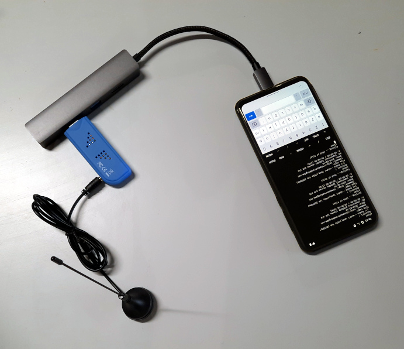

# 3- Groupe smartphone et balise parlante

!!! abstract "Contexte"

    Comment ça marche à Clermont-Ferrand ?
    
    Qu'est ce qui marche ? Qu'est ce qui pourrait être amélioré ?

## 1- Smartphone + clé RTL-SDR

Récupérer des smartphones qui dorment
Facilités de connexion (SMS, 3G, wifi, bluetooth...)

## 2- Vocalisation et reconnaissance vocale pour une balise parlante

